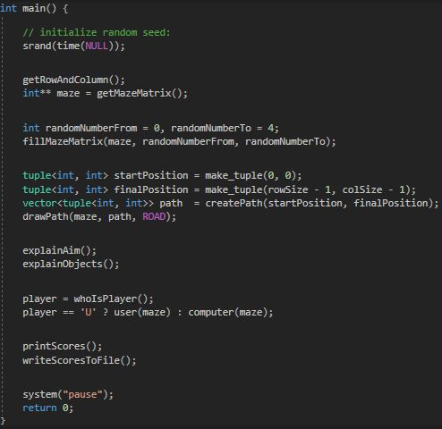

# Computer Programming Term Project

* User should enter the matrix size ( 10 <= matrixSize <= 100 ).
* The starting and end point of the maze can be accepted as (0,0) and (9,9) respectively.
* The roads can be set by hand but the program should also work with different mazes.
* The maze can have deat ends.
* The game should be restarted if the user is caught by a monster.
* The collected golds should be counted.
* When the game is finished, the collected gold number should be displayed.
* All movements should be saved in a text file shown in .

## Main Function

## Check Row and Column

## User Plays

| KEY | DIRECTION | ASCII |
|-----|-----------|-------|
| w   | UP        | 119   |
| a   | LEFT      | 97    |
| s   | DOWN      | 115   |
| d   | RIGHT     | 100   |
| r   | RANDOM    | 114   |

## User Plays With Computer Choice

## User Catched by Monster

## Computer Finds Path Automatically

Computer gets random direction either 's' or 'd' which means 'down' or 'right' respectively. Because the starting point is (0,0) and final point is (9,9).

Whenever it is caught by the monster, it forbids this point and restarts. 
Since there can be dead ends in the maze, computer should figure out those points and forbids them.

## Example Text File

